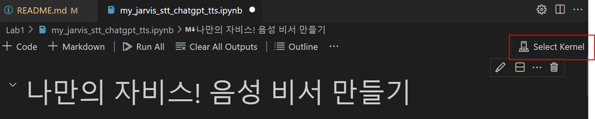
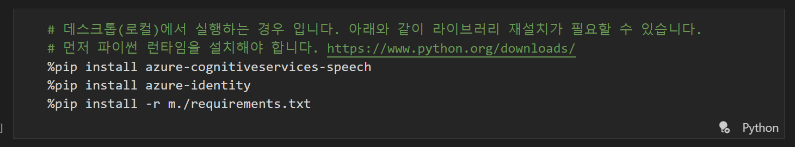

# Prerequisite

Visual Studio Code 설치

[https://code.visualstudio.com/download](https://code.visualstudio.com/download)

파이썬 런타임 설치

[https://www.python.org/downloads/](https://www.python.org/downloads/)

### 레포지토리 클론

1. 로컬에서 PowerShell 혹은 터미널을 실행시켜 아래 명령어를 입력합니다.

```bash
git clone https://github.com/Anna-Jeong-MS/AzureBasicWorkshop.git
```

1. Visual Studio Code에서 File > Open Folder 메뉴를 선택하고 클론한 디렉토리를 선택하여 열어줍니다.

### Visual Studio Code 환경 설정

1. Lab1 > my_jarvis_stt_chatgpt_tts.ipynb 파일을 선택하여 열어줍니다.
2. 상단의 오른쪽 Select Kernel 버튼을 클릭합니다.
    
    
    
3. Python Environments… 를 선택합니다.
4. Python 3.11.8 을 선택합니다.

### 라이브러리 설치

1. 첫번째 블록의 아래 두 줄을 주석 해제하여 실행합니다.
    
    (윈도우 사용자의 경우 ! 대신 %를 사용합니다.)
    
    