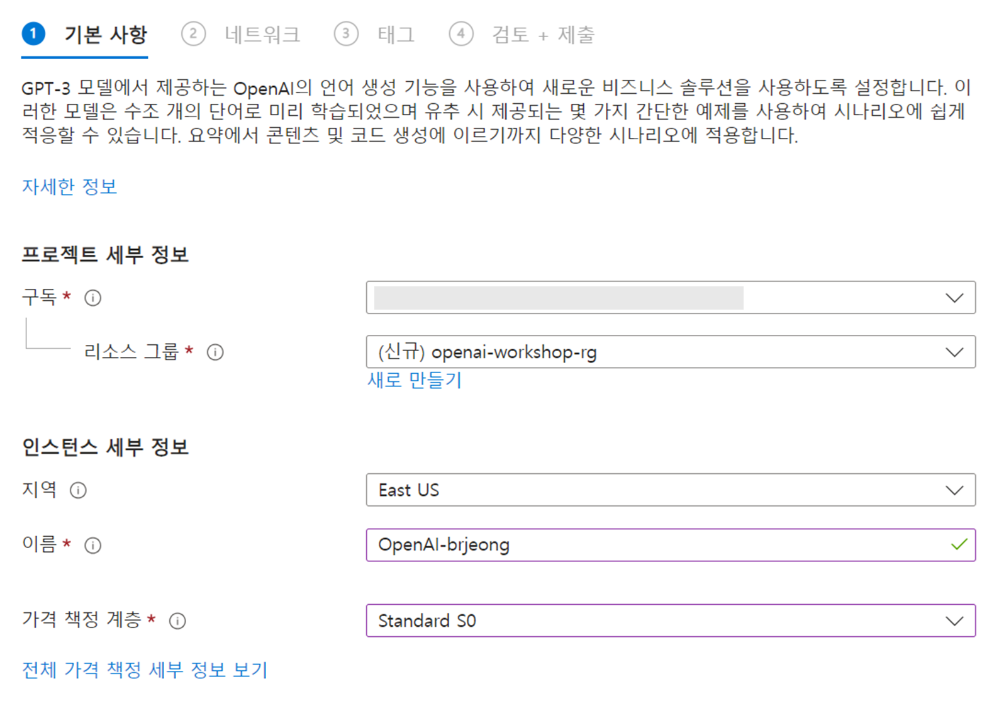
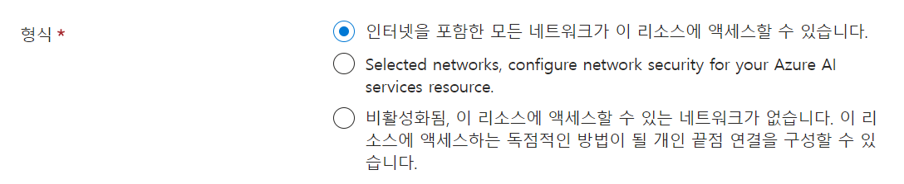
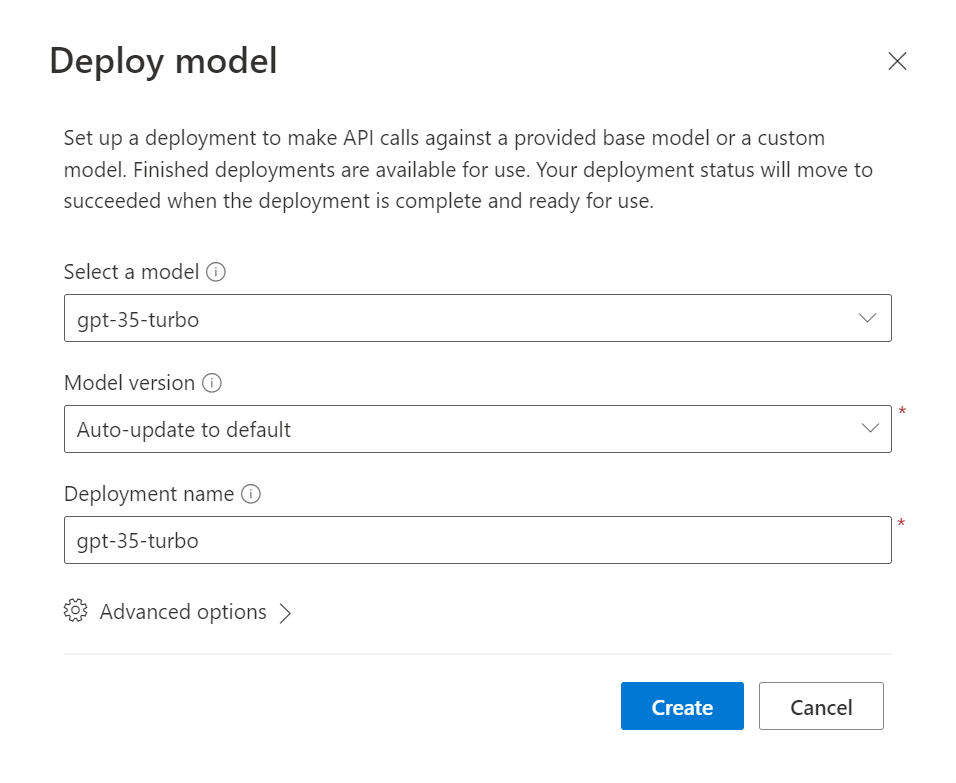
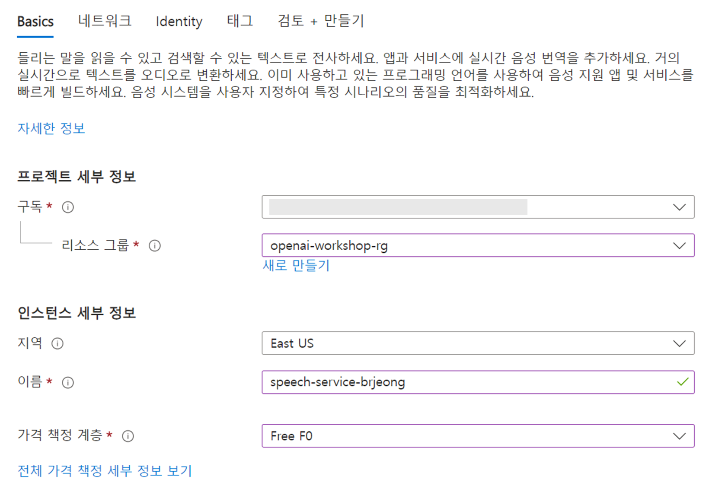

# Lab 0

### OpenAI 리소스 생성

1. Azure Portal([홈 - Microsoft Azure](https://portal.azure.com/#home))에 로그인합니다.
2. 상단 검색창에서 openai를 검색하여 Azure OpenAI 화면으로 이동합니다.
3. 왼쪽 상단의 만들기 버튼을 클릭합니다.
4. 아래와 같이 설정한 후 다음 버튼을 클릭합니다.
    
    
    
    - 구독 : 구독 선택
    - 리소스 그룹
        - 새로 만들기 버튼 클릭 후, openai-workshop-rg 입력
        - 지역 : East US
        - 이름 : OpenAI-<alias>
        - 가격 책정 계층 : Standard 0
5. 아래와 같이 설정한 후 다음 버튼을 두 번 눌러 만들기 버튼을 클릭합니다.
    
    
    
    - 형식 : 인터넷을 포함한 모든 네트워크 리소스가 이 리소스에 액세스할 수 있습니다.
6. 리소스 배포가 완료되면 리소스로 이동 버튼을 클릭합니다.
7. 왼쪽 메뉴에서 Model deployments를 클릭합니다.
8. 화면의 배포 관리 버튼을 마우스 오른쪽 버튼으로 클릭하고 Open link in new tab을 클릭하여  Azure OpenAI Studio로 이동합니다.
9. Deployments 화면에서 Create new deployment 버튼을 클릭합니다.
10. 아래와 같이 설정 후, Create 버튼을 클릭합니다.
    
    
    
    - Select a model : gpt-35-turbo
    - Model version : Auto-update to default
    - Deployment name : gpt-35-turbo

### 음성 서비스 리소스 생성

1. 다시 Azure Portal로 돌아와서 상단 검색창에 ai service를 입력하고 Azure AI Services 화면으로 이동합니다.
2. 왼쪽 메뉴에서 음성 서비스를 선택합니다.
3. 왼쪽 상단에 만들기 버튼을 클릭합니다.
4. 아래와 같이 설정 후, 검토 + 만들기 버튼, 만들기 버튼을 클릭합니다.
    
    
    
    - 구독 : 구독 선택
    - 리소스 그룹 : (앞서 생성한) openai-workshop-rg
    - 지역 : East US
    - 이름 : speech-service-<alias>
    - 가격 책정 계층 : Free F0