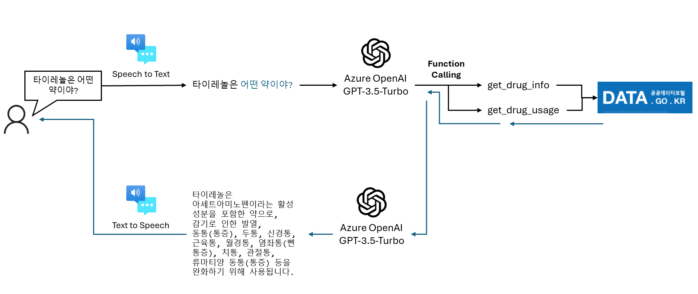

# AzureOpenAIWorkshop

## GPT란?
이 리포지토리에는 Azure OpenAI에서 제공하는 GPT(Generative Pre-trained Transformer)를 사용하는 기본 방법을 이해하고 샘플 솔루션을 및 다양한 사용 사례를 통해 이해에 도움이 되는 리소스가 포함되어 있습니다.

## Hands on Lab
ChatGPT의 **Function Calling** 기능을 활용하면, 아이언맨의 자비스와 같은 인공지능 비서를 만들 수 있습니다. 약품의 업체명, 제품명 등을 통해 서비스에 질의하면 복약 안내문을 응답하는 챗봇 서비스를 만듭니다.

1. 사용자의 음성은 Microsoft Azure가 제공하는 STT(Speech to Text) 서비스를 이용하여 텍스트로 변환합니다.
2. 텍스트는 ChatGPT가 제공하는 Function Calling 기능을 활용하여 이미 작성되어진 API 또는 코드를 선택적으로 수행합니다.
3. 수행 결과는 다시 Microsoft Azure가 제공하는 TTS(Text to Speech)를 이용하여 대답할 수 있습니다.

## GPT Version
현재 여기의 샘플은 주로 GPT 3.5를 기반으로 합니다. 일반적으로 gpt-35-turbo 최신 모델을 활용합니다. OpenAI의 모델 정책에 맞추어 Chat Completion API 기반으로 컨텐츠가 수정중에 있습니다. 한국어 토큰 길이에 대한 제약이 있을 경우에는 gpt-35-turbo-16k 모델을 활용하는 것을 추천 드립니다. GPT-4는 가용할 수 있는 자원이 충분히 확보된 시점에 업데이트할 예정입니다.

## Solution Accelerators
- **Business Process Automation:**
   - https://github.com/Azure/business-process-automation
   
- **Azure Cognitive Search + OpenAI**
   - https://github.com/Azure-Samples/azure-search-openai-demo

- **PowerApp + OpenAI**
   - https://github.com/Azure/azure-openai-samples/tree/main/solution_accelerators/PowerApp
   
- **Azure SQL Datbase + OpenAI**
   - https://github.com/louis-li/SqlGPT

- **ChatGPT + Enterprise data with Azure OpenAI**
   - https://github.com/lordlinus/Enterprise-ChatGPT

- **Azure OpenAI Semantic Search Demo | Document Upload**
   - https://github.com/MaheshSQL/openai-vector-search-demo

- **Redis + OpenAI**
   - https://github.com/louis-li/pdfGPT

## Relevant Repositories
- **OpenAI Cookbook**
   -  https://github.com/openai/openai-cookbook

- **Call center solutions:**
   - https://github.com/jakeatmsft/AzureOpenAIExamples/blob/main/Examples/Speech/Conversation_SSML%20OpenAI.ipynb 
   - https://github.com/amulchapla/AI-Powered-Call-Center-Intelligence 

- **Income Statement Analysis:**
   - https://github.com/jakeatmsft/AzureOpenAIExamples/blob/main/Examples/FormRecognizer/Balance_sheet_analysis.ipynb 

